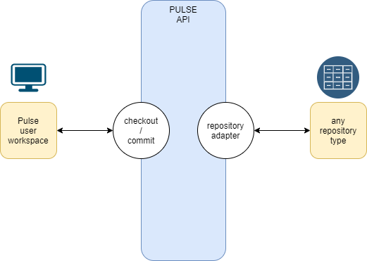

Pulse
=====

Pulse is a file manager and version control system for animation film, it is designed to support projects produced at
multiple locations.

Why would you need Pulse?

- to split a project between multiple locations, even with low bandwidth remote artists.
- to have the exact same path to access files for everyone involved
- to optimize your local network charge and load your files faster
- to guarantee your data integrity, by freezing and versionning every published file
- to choose where and how each resource will be stored, transparently for the artist

How do this look likes?

```python
# create a new resource, a shot animation
shot_anim = prj.create_resource("shot", "animation")
# check out the resource in the user sandbox
shot_anim_work = shot_anim.checkout()
# add the last Joe's proxy rig to this shot (download it to user cache if needed)
shot_anim_work.add_input(prj.get_resource("Joe", "rig").get_commit("last).get_product("proxy_rig")
# create a product folder to receive an alembic export
shot_anim_work.create_product("alembic")
# commit the new resource version
shot_anim_work.commit()
```


Version Control System
======================
You can think of Pulse as a version control system. Like SVN, the user checkout the resource to get a working copy,
and commit to publish a new version. Pulse shares a few concepts with other VCS:

- Pulse manages the versionning, the user doesn't think about it, he just commits
- a committed resource is stored in a repository, it won't be modified anymore, never. You can rely on your data.
- there's a diff system, showing you the change you made since last version.
- there's a lock system, preventing concurrent work

Anyway, there's a big difference with other VCS : Pulse doesn't deal with files, it deals with resources. You can see resource as
a files container, those files will be checkout together, worked together, commit and versioned together.
A character surfacing is a resource, a shot layout is a resource, etc...
The resource is the project's unit : a resource can't be split between repositories, and a resource is versioned as a whole.


But they are also a few differences which make Pulse so spicy...

Path consistency
=========================
The best way to ensure that artists respect the project path and naming convention is to do it for them.
Every files registered by Pulse must be located into a resource folder, and those folder are created and managed by Pulse.

Unlike other VCS, the user doesn't chose the resource path, it is built by Pulse based on the project configuration. The user just check out the resource by its name, and the files will be downloaded at the very same path for everyone else working on the project.


Tracking Dependencies
=====================
Another difference from a classical version system, is the dependencies tracking. If a user needs to add an input to his working copy,
he has to declare it. All resources inputs and outputs versions are tracked by Pulse.
So when a user checkout a resource, all the needed inputs will be downloaded in the user cache, only if they're not already there. He can even check out all the resources during the night, to optimize his bandwidth.
Dependencies tracking also helps to purged unused resources. Pulse have utilities for this based on the unused time.


Repositories
============
Each Pulse Resource is linked to a repository, and your project can contain many repositories, even from different type :
network share, ftp, google drive...
Pulse even comes with a plug-in adapter architecture which allow you
to write your very own repository type.





Q/A
===

My artists work all in the same location, what's the point to use Pulse?
    Yes! Pulse act like a local cache, it leverages greatly server access even in the same network. The fastest file trqnsfer
is the one which doesn't need to occur.


What's the difference between Pulse and Shotgun?
    Pulse is not a production tracker, it does not care about what's approved or done. (even if you could use
    metadata to carry extra information)


