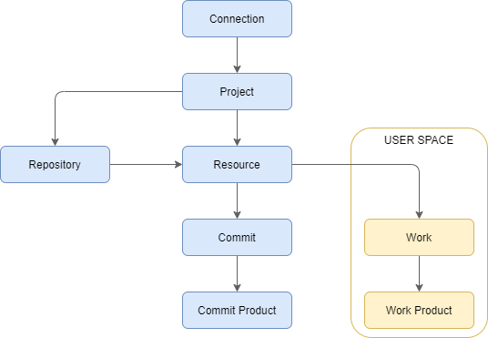

.. Pulse documentation master file, created by
   sphinx-quickstart on Mon Jun  1 21:40:09 2020.
   You can adapt this file completely to your liking, but it should at least
   contain the root `toctree` directive.

Welcome to Pulse's documentation!
=================================

Pulse is a resource version control system.

A resource is project fragment, generating products used by other resources.

Here is a basic description of the objects you will manipulate when using pulse

.. toctree::
   :maxdepth: 2
   :caption: Contents:

.. automodule:: pulse.api

Indices and tables
==================

* :ref:`genindex`
* :ref:`modindex`
* :ref:`search`
